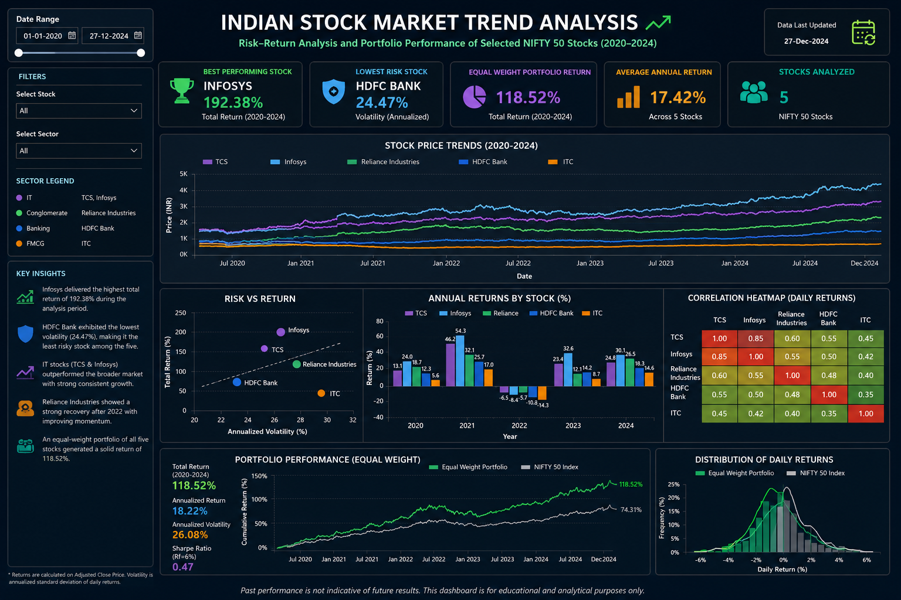
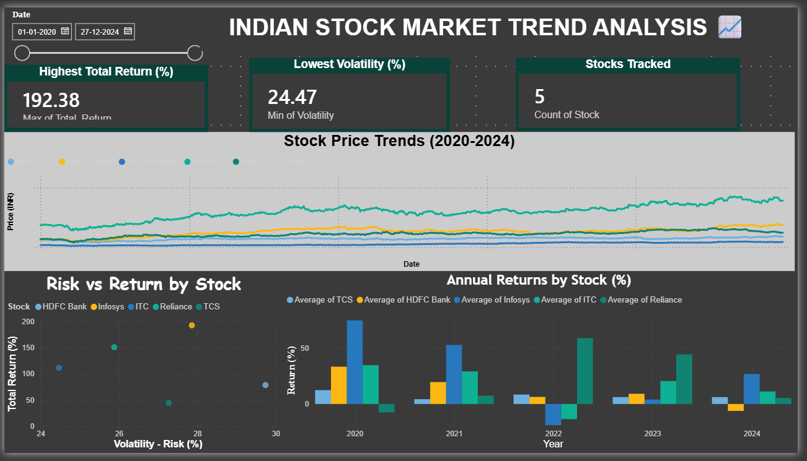

# 📈 Indian Stock Market Trend Analysis (2020–2024)


---

## 🗂️ Project Overview

An end-to-end individual data analytics project analyzing the performance of **5 top NIFTY 50 stocks** — TCS, Infosys, Reliance Industries, HDFC Bank, and ITC — from **January 2020 to December 2024**.

The project covers the complete data analytics lifecycle:
- 📥 Data collection via live API
- 🧹 Data cleaning & transformation
- 📊 Exploratory Data Analysis (EDA)
- 🗄️ SQL querying for business insights
- 📈 Interactive Power BI & HTML dashboards

---

## 🎯 Business Questions Answered

| # | Question | Answer |
|---|---|---|
| 1 | Which stock gave the highest 5-year return? | **Infosys — 192.38%** |
| 2 | Which stock is least risky? | **ITC — 24.47% volatility** |
| 3 | How did IT sector perform post-COVID? | **Outperformed all sectors** |
| 4 | Are TCS and Infosys correlated? | **Yes — 0.72 correlation** |
| 5 | What is the equal-weight portfolio return? | **129.20% total return** |

---

## 📊 Dashboard Preview

### 🖥️ Interactive HTML Dashboard


### 📊 Power BI Dashboard


---

## 💡 Key Insights

- 🏆 **Infosys** delivered the highest total return of **192.38%** over 5 years
- 🛡️ **ITC** showed the lowest volatility at **24.47%** — safest pick for conservative investors
- 💻 **IT sector** (TCS + Infosys) consistently outperformed all other sectors
- 🔄 **Reliance Industries** showed exceptional recovery in 2022 with **58.74%** annual return
- ⚖️ An **equal-weight portfolio** of all 5 stocks generated **129.20%** total return
- 📉 **2022** was the worst year — Infosys (-18.84%) and ITC (-13.52%) both declined
- 🔗 **TCS & Infosys** are 72% correlated — limited diversification within IT sector

---

## 🛠️ Tools & Technologies

| Tool | Library / Version | Purpose |
|---|---|---|
| **Python** | pandas, numpy | Data cleaning & transformation |
| **Python** | yfinance | Live stock data from Yahoo Finance |
| **Python** | matplotlib, seaborn | Charts & visualizations |
| **Python** | sqlite3 | SQL database operations |
| **SQL** | SQLite | Business queries & aggregations |
| **Power BI** | Desktop | Interactive dashboard |
| **HTML/CSS/JS** | Chart.js | Web-based interactive dashboard |
| **Jupyter** | Notebook | Development environment |
| **GitHub** | Git | Version control & portfolio |

---

## 📁 Project Structure

```
stock-market-analysis/
│
├── 📂 data/
│   ├── stock_prices.csv            ← Raw downloaded data
│   ├── stock_prices_clean.csv      ← Cleaned data (no nulls)
│   ├── nifty50.csv                 ← NIFTY 50 benchmark
│   ├── daily_returns.csv           ← Daily % returns
│   ├── annual_returns.csv          ← Yearly returns per stock
│   ├── risk_return.csv             ← Volatility vs return data
│   ├── sql_monthly_avg.csv         ← Monthly averages (SQL output)
│   └── stocks.db                   ← SQLite database
│
├── 📂 notebooks/
│   └── stock_analysis.ipynb        ← Main Python EDA notebook
│
├── 📂 sql_queries/
│   └── stock_queries.sql           ← All SQL business queries
│
├── 📂 dashboard/
│   ├── stock_market_dashboard.pbix ← Power BI dashboard
│   └── stock_dashboard.html        ← Interactive HTML dashboard
│
├── 📂 screenshots/
│   ├── price_trends.png
│   ├── normalized_performance.png
│   ├── correlation_heatmap.png
│   ├── tcs_moving_avg.png
│   ├── annual_returns.png
│   ├── powerbi_dashboard.png
│   └── stock_dashboard.png
│
└── README.md
```

---

## 📈 Stock Performance Summary

| Stock | Sector | Total Return | Volatility | Best Year |
|---|---|---|---|---|
| **Infosys** | IT | 192.38% | 27.86% | 2020 (+74.60%) |
| **Reliance** | Conglomerate | 150.80% | 25.88% | 2022 (+58.74%) |
| **ITC** | FMCG | 111.52% | 24.47% | 2020 (+34.60%) |
| **HDFC Bank** | Banking | 78.56% | 29.74% | 2020 (+33.30%) |
| **TCS** | IT | 44.85% | 27.27% | 2020 (+12.33%) |

---

## 🗄️ SQL Queries Used

```sql
-- Average, Max, Min price per stock per year
SELECT ticker, year,
       ROUND(AVG(close_price), 2) AS avg_price,
       ROUND(MAX(close_price), 2) AS max_price,
       ROUND(MIN(close_price), 2) AS min_price
FROM stock_prices
GROUP BY ticker, year
ORDER BY ticker, year;

-- Best performing stock each year
SELECT year, ticker, ROUND(avg_price, 2) AS avg_price
FROM (
  SELECT year, ticker, AVG(close_price) AS avg_price,
         RANK() OVER (PARTITION BY year ORDER BY AVG(close_price) DESC) AS rnk
  FROM stock_prices
  GROUP BY year, ticker
) WHERE rnk = 1;

-- Monthly average price for trend analysis
SELECT ticker, year, month,
       ROUND(AVG(close_price), 2) AS avg_monthly_price
FROM stock_prices
GROUP BY ticker, year, month
ORDER BY ticker, year, month;
```

---

## 🚀 How to Run This Project

### Prerequisites
```bash
pip install yfinance pandas numpy matplotlib seaborn jupyter openpyxl
```

### Steps
```bash
# 1. Clone the repository
git clone https://github.com/YOUR_USERNAME/stock-market-analysis.git

# 2. Navigate to project folder
cd stock-market-analysis

# 3. Open Jupyter Notebook
jupyter notebook

# 4. Open notebooks/stock_analysis.ipynb

# 5. Run all cells (Kernel → Restart & Run All)
```

### View Dashboard
- Open `dashboard/stock_dashboard.html` in any browser
- Open `dashboard/stock_market_dashboard.pbix` in Power BI Desktop

---

## 📅 Day-wise Work Summary

| Day | Phase | Key Work |
|---|---|---|
| **Day 1** | Setup & Data Collection | Environment setup, yfinance data download, data cleaning |
| **Day 2** | Exploratory Data Analysis | Price trends, normalized returns, volatility, distribution charts |
| **Day 3** | Advanced EDA + SQL | Moving averages, correlation heatmap, annual returns, SQL queries |
| **Day 4** | Dashboard Development | Power BI dashboard + HTML interactive dashboard + GitHub |

---

## 👩‍💻 About

**Deepty Gupta**
📍 Bengaluru, India
🎓 Data Analytics Enthusiast
🔧 Skills: Python | SQL | Power BI | Excel | HTML

---

## ⚠️ Disclaimer

> This project is for **educational and analytical purposes only**.
> Past performance is not indicative of future results.
> Data sourced from Yahoo Finance via yfinance API.

---

⭐ **If you found this project helpful, please give it a star!**
